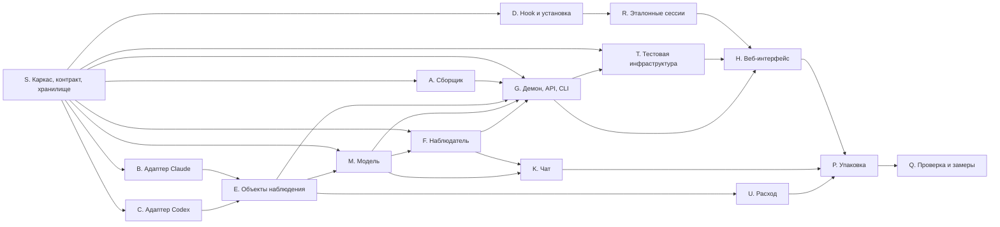

# План реализации MVP

Статус: принято владельцем 2026-10-01. Основание: `rfc.md` (§4 задаёт границы), ADR-0001…0012 (приняты), ADR-0013 (поддержка Windows: требование, обработчик hook на Go и остальные технические решения приняты владельцем 2026-10-01).

## Правила выполнения

- **Размер PR.** PR логически цельный и ревьюабельный: обычно один-два пункта плана. Жёсткого лимита строк нет (AGENTS.md). Записанные эталонные сессии — сгенерированный код и идут отдельными PR без кода.
- **Ревью.** Реализацию и исправления ведут сессии Claude Code на Opus. Каждый PR до мержа проходит кросс-ревью в новой сессии Codex на gpt-6-astra с reasoning xhigh.
- **Одобрение ADR.** Аспект начинается только после одобрения ADR из колонки «ADR» таблицы ниже. ADR-0001…0012 приняты. Обработчик hook на Go (ADR-0013) принят, поэтому D.1 не ждёт остального ADR-0013. Пункты, зависящие от других технических решений ADR-0013 (особенности Windows), начинаются после их одобрения.
- **Изменения общих пакетов после этапа 0:**
  - `contract` — отдельные малые PR, которые мержатся раньше зависящих от них PR;
  - схема `store` — до первого выпуска правится на месте отдельными PR в `store`, мержатся по очереди; миграции появляются после выпуска;
  - репозитории таблиц пишет аспект-владелец таблиц в своих PR (таблица владения ниже).
- **Тесты в том же PR.** Приёмку PR проверяют тесты из этого же PR, CI зелёный. Исключения:
  - PR чистых типов `contract` — проверяются типизацией и первыми потребителями;
  - инфраструктурный S.1a — проверяется прогоном CI;
  - проверки на настоящих CLI и чек-листы (A.5, D.5–D.8, F.3, Q) — отчёт в `docs/research/`; D.8 идёт в GitHub Actions, остальные — локально;
  - записи эталонных сессий (R.4) — проверяются прогонами R.5a и R.5b;
  - документация (P.3).
- **Тестирование — по ADR-0012:**
  - моки только на внешних границах (рантаймы, LLM-CLI, сторонние процессы установки);
  - функциональные тесты `engine` идут через настоящие адаптеры;
  - сбои моделируются через SIGKILL (`TerminateProcess` на Windows);
  - временные пороги в CI — с запасом, строгие — в локальных бенчмарках с тегом.
- **Платформы.** macOS, Linux и Windows (ADR-0013): CI идёт по матрице трёх ОС, специфика Windows входит в приёмку затронутых пунктов.

## Обзор

| Аспект | Пакеты | ADR | Старт после | Этап |
| --- | --- | --- | --- | --- |
| S. Каркас, контракт, хранилище | все (каркас), `contract`, `store` | 0001, 0004–0013 | одобрения ADR | 0 |
| A. Сборщик | `collector` | 0004, 0005, 0011, 0013 | S.2a, S.7 | 1 |
| B. Адаптер Claude | `adapter-claude` | 0004, 0006, 0009, 0010 | S.2b | 1 |
| C. Адаптер Codex | `adapter-codex` | 0004, 0006, 0009, 0010 | S.2b | 1 |
| D. Hook и установка | `hook` | 0004, 0011, 0013 | S.2a | 1 |
| R. Эталонные сессии и матрица | `tools/record`, `fixtures`, `support` | 0004, 0010, 0013 | D.1, D.2 | 1–2 |
| E. Приём и объекты наблюдения | `engine` | 0004–0006, 0008, 0009 | S.7, B.1, B.3 | 1 |
| M. Модель и представление | `engine` | 0005–0008 | S.3b, S.4a, S.6c | 1 |
| F. Наблюдатель | `observer`, `testkit/fake-cli` | 0002, 0007, 0010, 0013 | S.4a, S.6c | 1 |
| G. Демон, API, CLI | `daemon`, `cli`, `aang` | 0003–0005, 0010, 0011, 0013 | S.5, S.6a | 1 |
| T. Тестовая инфраструктура | `testkit` | 0004, 0010, 0012 | S.2a | 1 |
| H. Веб-интерфейс | `web` | 0008, 0011, 0012 | G.4, G.5, T.4, R.4 | 2 |
| K. Чат | `observer`, `engine`, `daemon` | 0007, 0008 | M.6, M.7, F.9, G.6 | 2 |
| U. Расход наблюдателя и отчёт | `engine`, `daemon`, `cli` | 0009 | E.8, F.9, G.4 | 2 |
| P. Упаковка | корень, `aang`, `daemon` | 0011, 0013 | H, K, U | 3 |
| Q. Проверка и замеры | — | 0010, 0013, RFC §9 | P | 3 |

### Владение таблицами `store`

| Таблицы (ADR-0005) | Владелец |
| --- | --- |
| сырые записи, факты, курсоры с решением охвата, `gaps` | S.7 |
| объекты наблюдения, прогоны, связи, `bindings` | E |
| модель, журнал, версии, `fact_interpretation`, `view_marks`, `attention_views`, `view_rules` | M |
| `observer_calls` | F |
| `chat_messages` | K |
| `settings` | G |

### Сессии и параллельность

- **Этап 0** — две сессии после S.1:
  - «контракт» (S.1–S.5);
  - «хранилище» (S.6–S.7).
- **Этап 1:**

  | Сессия | Аспекты | Когда начинается |
  | --- | --- | --- |
  | 1 | A | после S.2a и S.7 |
  | 2 | B, затем B.7 | после S.2b |
  | 3 | C, затем C.6 | после S.2b |
  | 4 | D, затем R | после S.2a |
  | 5 | E | после B.1 и B.3; до них — подготовка по ADR |
  | 6 | M | после S.6c |
  | 7 | F | после S.4a |
  | 8 | G.1, затем T.1–T.3, затем остальной G | после S.5 и S.6a |

  Сессии E и M не объединяются: от них зависят G, F, K и H. Сессии G и T объединяются, потому что G.3 ждёт E.1–E.3 и T заполняет это время; G.1 идёт первым, потому что от него зависит T.1.
- **Этап 2:** H.1 делает одна сессия, затем H делится на три линии (факты и внимание; карта и инспектор; возвращение, чат, расход). K продолжает сессия F, U — сессия E. B.7 и C.6 сессии B и C делают сразу после R.4, до полного контрактного прогона R.5b.

**Критический путь:**

S.1a → S.2a → S.2b → B.1, B.3 → E.1 → E.2 → E.3 → M.6 → G.3 → G.4, G.5 → T.4 → H.1 → H.4 → H.6 → H.8 → P → Q.

Параллельно с ним должны успеть:

- R.1 → R.2 → R.4 — согласованные записи для E2E;
- F.6 (допуск версии) → F.9 → G.6 — наблюдатель в демоне для H.4–H.6;
- D.6 → G.7 — первое реальное использование проверки trust;
- K.2 — для H.8.

## Контрольные точки

| Точка | Состав | Что видит пользователь | E2E (ADR-0012) |
| --- | --- | --- | --- |
| К1. Факты без LLM | S; A; B.1–B.6; C.1–C.5; D.1–D.6, D.8; E.1–E.7c; M.1, M.6; G.1–G.5, G.7; T.1–T.5; R.1–R.5a; H.1–H.2 | прогоны, сессии, агенты, действия, факты плана; явные запросы в зоне внимания; режимы поддержки; потеря источника | 2, 9, 10, 12, 13 |
| К2. Смысловая карта | B.7, C.6, R.5b; D.9; M.2–M.5c; F.1–F.9; G.6; T.6; H.3–H.6, H.11 | этапы, три оси, основания, сохранённые версии, инспектор, сохранение выбора, отказ LLM, Codex с OTel | 1, 3, 7, 8, 14, 17 |
| К3. Возвращение и чат | E.8–E.9; M.7–M.8; G.8–G.12; K; U; H.7–H.10, H.12 | «С последнего просмотра», чат, правила вида, снятие пунктов, расход, перезапуск | 4, 5, 6, 11, 15, 16, 18; варианты по рантаймам и поверхностям |
| К4. Поставка и поддержка | F.10, P, Q | npm и Docker, матрица поддержки, замеры свежести и экономики | все; Q — на живых сессиях |

## Этап 0. Каркас, контракт, хранилище (S)

- **S.1a Рабочая область и CI**.
  - Состав:
    - pnpm workspace, `tsconfig` strict с project references;
    - заготовки 12 пакетов из ADR-0011;
    - Vitest workspace, конфиг Playwright, сведение покрытия `c8`;
    - тулчейн Go для `aang-hook`;
    - CI на GitHub Actions по матрице macOS, Linux и Windows: установка, типы, тесты, задание E2E.
  - Приёмка: `pnpm install && pnpm build && pnpm test` проходит на чистом клоне; CI зелёный на трёх ОС.
- **S.1b Правила репозитория**.
  - Состав:
    - ESLint: направление зависимостей ADR-0011, тестам `engine` разрешены адаптеры;
    - `tools/check-comments` — запрет комментариев в TS, Go, SQL, YAML, CSS; исключения — shebang и синтаксически значимые директивы.
  - Приёмка: проверки падают на файлах-нарушителях каждого языка и проходят на чистых.
  - Тесты: интеграционные, проверки запускаются над временными файлами.
- **S.2a Контракт: spool, сырые записи, интерфейсы**.
  - Состав:
    - брендированные id;
    - конверт сырой записи;
    - формат spool-файла (ADR-0004);
    - интерфейс адаптера (`streamKey`, `rawKey`, `parse`) и сборщика (`start`, порция, `ack`);
    - функции детерминированных id фактов и объектов (ADR-0005).
  - Приёмка: типизация; стабильность id проверяют функциональные тесты E.1 и E.9 (юнит-тестов заранее не разрешено, ADR-0012).
- **S.2b Контракт: факты**.
  - Состав: объединение видов фактов с `entity_key`, `speaker`, `urgent` и схемами payload по видам ADR-0006, включая git-снимок, снимок JSON-файла, контекст и потерю источника.
  - Приёмка: типизация; первые потребители — B.1 и C.1.
- **S.3a Контракт: объекты наблюдения**.
  - Состав: сессия, агент, действие (контейнер code mode), вопрос, версия артефакта, git-снимок, запись usage, пробел, режим поддержки.
- **S.3b Контракт: модель и журнал**.
  - Состав:
    - прогон, этап, критерий, карточка, пункт внимания, связи;
    - оси выполнения, основания с интерпретатором и решения человека;
    - запись журнала и статусы интерпретации;
    - отметки и правило вида с закрытыми вариантами селектора.
- **S.4a Контракт: протокол наблюдателя и JSON Schema**.
  - Состав: вход и выход наблюдателя; операции ADR-0007 как закрытые варианты `anyOf`; генерация схемы.
  - Приёмка: схема соблюдает ограничения строгого режима из ADR-0007 (объект в корне, `additionalProperties: false`, все поля в `required`, нет свободных словарей, `oneOf`, `allOf`, `not`, `if`).
  - Тесты: контрактный — проверка ограничений по сгенерированной схеме.
- **S.4b Контракт: чат и правило вида**.
  - Состав: вход и выход чата с `needs` (ADR-0008), предложение правила; генерация схемы из S.4a.
  - Приёмка и тесты: как S.4a.
- **S.5 Контракт: API, SSE, конфиг, матрица**.
  - Состав:
    - DTO всех эндпоинтов ADR-0011;
    - события SSE, включая `reset`;
    - схема `config.json` с умолчаниями (корни рантаймов, отслеживаемые корни, `lookback`, сборщик с `fsWatch` и интервалами обхода, наблюдатель с моделями, effort, `crossVendor` и бюджетом, пути CLI, адрес, контракты проверки);
    - формат `support/matrix.json` с ключом `(рантайм, поверхность, ОС, размещение, версия движка)`.
  - Приёмка: конфиг по умолчанию загружается и проходит схему.
  - Тесты: интеграционный — загрузка конфига из временного каталога.
- **S.6a Хранилище: раннер, lock, транзакции**.
  - Состав: применение схемы с `PRAGMA user_version`; lock-файл единственного писателя; помощник транзакций; выдача `change_seq`.
  - Приёмка: второй писатель получает отказ; откат не оставляет частичных строк; повторное открытие ничего не меняет.
  - Тесты: интеграционные на реальном SQLite.
- **S.6b Хранилище: схема сырых слоёв**.
  - Состав: сырые записи, факты, курсоры с потоком и решением охвата, `gaps`.
  - Тесты: интеграционные — уникальность ключей, ограничения.
- **S.6c Хранилище: схема модели и служебных таблиц**.
  - Состав: объекты, прогоны, связи, привязки, blob версий-оснований, модель, журнал, версии, `fact_interpretation` (включая `deferred`), отметки с парой «версия и `change_seq`», правила, чат, `observer_calls` с базовой версией, `pruned_streams`, `settings`.
  - Тесты: как S.6b.
- **S.7 Хранилище: репозитории сырых слоёв**.
  - Состав: вставка с дедупликацией по `dedupe_key`, факты, курсоры с решением охвата, лента «изменения после `change_seq`».
  - Приёмка: повторная вставка сообщает «дубль» и не создаёт строк; курсор и записи сохраняются одной транзакцией.
  - Тесты: интеграционные.

## Этап 1. Параллельные аспекты

### A. Сборщик (`collector`)

- **A.1 Spool** (S.2a, S.7).
  - Состав:
    - fs watch на `spool/new` как сигнал; перечисление каталога при старте, раз в 5 с и сразу после ошибки, переполнения или закрытия watcher с его пересозданием (ADR-0004, ADR-0013);
    - файлы, выданные в порцию и ещё не подтверждённые, повторно не выдаются;
    - разбор заголовка; время приёма — `mtime` в наносекундах;
    - порции; `ack` удаляет файл;
    - при старте — отбрасывание файлов старше срока с пробелом и очистка `spool/tmp`;
    - статистика spool.
  - Приёмка:
    - событие попадает в порцию за ≤ 1 с в CI (≤ 100 мс локально);
    - с `collector.fsWatch: false` файл, появившийся в `spool/new` без уведомления и без перезапуска, попадает в порцию в пределах интервала обхода, выдаётся один раз и удаляется только после `ack`;
    - без `ack` файл остаётся и выдаётся повторно после перезапуска;
    - устаревшие файлы отбрасываются с пробелом.
  - Тесты: интеграционные на реальных файлах; формат файлов — по S.2a.
- **A.2 Хвост JSONL**.
  - Состав:
    - рекурсивный watch и обход по `stat` раз в 60 с и сразу после ошибки или переполнения watcher;
    - курсор `(путь, dev, inode, смещение, номер строки, размер, ordinal)`;
    - только завершённые строки, `\r\n` допускается;
    - идентичность файла через `fs.stat` с `bigint` (на Windows — серийный номер тома и индекс NTFS);
    - повтор чтения, если пишущий процесс держит блокировку, затяжная неудача — пробел;
    - курсоры принимаются на старте и возвращаются в порциях.
  - Приёмка:
    - дописывание, неполная последняя строка, разрыв многобайтового символа и перезапуск с курсора не теряют и не повторяют строк;
    - с `collector.fsWatch: false` дописанные строки читаются в пределах интервала обхода;
    - 500 файлов отслеживаются без пропусков.
  - Тесты: интеграционные на трёх ОС; разрыв многобайтового символа — запись половины строки в реальный файл, чтение, дозапись.
- **A.3 Снимки JSON-файлов**.
  - Состав: `*.meta.json`, `teams/*/config.json`, `workflows/*.json`, реестр `sessions/*.json`; выдача снимка при изменении содержимого и события исчезновения файла.
  - Приёмка: последовательность снимков реестра, восстановленная из журнала наблюдений `claude-code-transcripts/sessions-registry-lifecycle-observed.jsonl`, выдаётся без повторов.
  - Тесты: интеграционные.
- **A.4 Приёмник OTel**.
  - Состав: отдельный listener на `127.0.0.1`, путь `/otel/<токен>/v1/logs`, ответ `200` до обработки, отбор `codex.tool_decision`.
  - Приёмка:
    - OTLP-запрос, собранный из записей `codex-otel/logs.tool_decision.variants.jsonl` (обёрнутых в конверт по `logs.envelope.tool_decision.approved-user.app-server.json`), даёт записи;
    - события `logs.other-events.jsonl` на диск не попадают;
    - неверный токен — 404.
  - Тесты: интеграционные по HTTP.
- **A.5 Путь с токеном на настоящем `codex`** (локально, отчёт).
  - Состав: `codex exec` на заглушке Responses API с `-c otel.…`, указывающим на путь с токеном.
  - Приёмка: приёмник получает `codex.tool_decision` с `source: Config` (ADR-0004).
- **A.6 Перенос, архив, потеря** (B.3, C.1).
  - Состав:
    - распознавание смены inode, уменьшения и исчезновения файла;
    - поиск потока через `streamKey` адаптеров: Claude — в `projects/`, Codex — в `archived_sessions/`;
    - перечитывание; сигнал `source_lost`.
  - Приёмка: перенос в `*.superseded-*` и `codex archive` продолжают поток; удаление даёт `source_lost`.
  - Тесты: интеграционные с настоящими адаптерами.
- **A.7 Бэкфилл и перечитывание**.
  - Состав: файлы без курсора в пределах `lookback`; `rescan(потоки)` с начала по запросу `engine`.
  - Приёмка: файлы старше `lookback` не читаются; файлы с курсором читаются с курсора; `rescan` перечитывает с начала.
  - Тесты: интеграционные.
- **A.8 Файлы-вложения**.
  - Состав: чтение текстовых файлов `tool-results/*`, на которые ссылается `persistedOutputPath`, по запросу `engine`; сохранение как сырой записи с хешем.
  - Приёмка: вывод Bash, вынесенный в файл, доступен после удаления исходного файла.
  - Тесты: интеграционные.

### B. Адаптер Claude (`adapter-claude`)

Образцы — в `docs/research/samples/`: `claude-code-hooks/`, `claude-code-transcripts/`, `claude-agent-sdk/`, `desktop/exp-cc-*`.

- **B.1 Hooks: инструменты и разрешения**.
  - Состав:
    - `PreToolUse`, `PostToolUse`, `PostToolUseFailure`, `PostToolBatch`, `PermissionRequest`, `PermissionDenied`, `Notification`;
    - поверхность по заголовку окружения;
    - ключ содержимого для двойной доставки;
    - пометка сессии наблюдателя.
  - Приёмка: каждый образец даёт факты с ожидаемыми видом, сессией, агентом и `tool_use_id`, если он есть в payload.
  - Тесты: интеграционные на образцах; проверяются ключевые поля.
- **B.2 Hooks: сессия, ход, агенты, сжатие**.
  - Состав: `SessionStart` по источникам, `SessionEnd`, `UserPromptSubmit`, `Stop` с `background_tasks`, `SubagentStart`/`SubagentStop`, `PreCompact`/`PostCompact`, `InstructionsLoaded`, `TaskCreated`/`TaskCompleted`, `Elicitation*`; прочие события — общий факт.
  - Приёмка и тесты: как B.1.
- **B.3 Транскрипт основного потока**.
  - Состав:
    - `streamKey` и `rawKey`;
    - `user`, `assistant`, `tool_use`/`tool_result` с `toolUseResult`;
    - служебные строки, `queue-operation`, `compact_boundary`, `isCompactSummary`;
    - `speaker`, `urgent`, версия;
    - `thinking` не попадает в содержание;
    - `parse_state=unknown` для неизвестного.
  - Приёмка: `session-86f93ed5-main-full.jsonl` и `rec-*` разбираются без `invalid`.
  - Тесты: интеграционные.
- **B.4 Субагенты, workflows, teammates**.
  - Состав:
    - транскрипт и meta субагента (образцы `subagent-agent-aad616394e806288d.{jsonl,meta.json}`);
    - журнал и снимок workflow, `teams/*/config.json` — без образцов, разбор помечен непроверенным.
  - Приёмка: субагент связан с вызовом `Agent` по `meta.toolUseId` и `toolUseResult.agentId`.
  - Тесты: интеграционные.
- **B.5 Признаки форка, план, вопросы**.
  - Состав:
    - `uuid`, `message.id` и время записей для правила форка;
    - `ExitPlanMode` и инструменты задач;
    - `AskUserQuestion` с `answers`;
    - `origin.kind`/`promptSource`.

    Разбор плана, ответов и уведомлений без образцов помечен непроверенным.
  - Приёмка: `session-cdfb3544-fork-full.jsonl` даёт факты, по которым видна граница скопированного блока.
  - Тесты: интеграционные.
- **B.6 Usage, `cost-state`, реестр**.
  - Состав: факты usage (`message.id`, токены, `stop_reason`, `<synthetic>`); итог `cost-state`; снимки реестра с пометкой `entrypoint: aang-observer`.
  - Приёмка: `rec-cost-state-all.jsonl` и записи основного потока дают ожидаемые ключи и значения.
  - Тесты: интеграционные.
- **B.7 Доработка по эталонным сессиям** (R.4).
  - Состав: снять пометки «непроверено» с плана, ответов, `Elicitation`, teammates, workflows и уведомлений о фоновых задачах.
  - Приёмка: PR добавляет свои сценарии Claude в существующий прогон R.5a и запускает их: без `unknown` среди покрытых типов. R.5b затем делает весь набор обязательным.

### C. Адаптер Codex (`adapter-codex`)

Образцы — в `docs/research/samples/`: `codex-cli/`, `codex-sdk/`, `codex-otel/`, `desktop/exp-codex-*`.

- **C.1 Rollout: метаданные и ходы**.
  - Состав: `streamKey` (`session_meta.id`), `rawKey` (`thread_id`, `ordinal`), `session_meta`, `task_started`/`task_complete`/`turn_aborted`, `turn_context`.
  - Приёмка: `rollout-real-exec-then-resume-with-compaction.jsonl` разбирается без `invalid`.
  - Тесты: интеграционные.
- **C.2 Rollout: элементы и code mode**.
  - Состав:
    - `item_completed`: `CommandExecution`, `FileChange`, `AgentMessage` с `questions`, `UserMessage`, `ContextCompaction`, а также `McpToolCall` (без образца, непроверено);
    - старт по `function_call`/`custom_tool_call`;
    - ячейка code mode как контейнер вложенных команд.
  - Приёмка: каждый образец `codex-cli/rollout/` даёт ожидаемые факты.
  - Тесты: интеграционные.
- **C.3 Субагенты, fork, сжатие, usage**.
  - Состав: `SubAgentActivity`, `CollabAgentToolCall`, межагентные сообщения; `compacted`; `token_usage_record` с `thread_id` из `session_meta.id`; `token_count` — только как несуммируемый.
  - Приёмка: `session_meta.fork.mock.json` даёт `forked_from_id`; на образце rollout сумма записей usage равна последнему `thread_token_usage`.
  - Тесты: интеграционные.
- **C.4 Hooks Codex**.
  - Состав: 12 событий; `tool_use_id` = `call_id`; `agent_id` субагента; снятие обёртки образцов `{"_observed_env_CODEX_vars","stdin"}`.
  - Приёмка: образцы `codex-cli/hooks/` и `desktop/exp-codex-desktop-appserver-hooks.jsonl` дают ожидаемые факты.
  - Тесты: интеграционные.
- **C.5 OTel, поверхность, самоисключение**.
  - Состав:
    - `codex.tool_decision` с разделением `source` (`User`, `Config`, `AutomatedReviewer`);
    - таблица `originator × source`;
    - пометка сессий наблюдателя.
  - Приёмка: все варианты OTel распознаны; образцы `session_meta.*` (exec, tui, guardian, субагент, `aang-observer`) классифицированы по ADR-0004.
  - Тесты: интеграционные.
- **C.6 План и доработка по эталонным сессиям** (R.4).
  - Состав: `thread_goal_updated` и записи плана rollout; `McpToolCall`; итог треда без `token_usage_record`.
  - Приёмка: PR добавляет свои сценарии Codex в существующий прогон R.5a и запускает их: без `unknown` среди покрытых типов. R.5b затем делает весь набор обязательным.

### D. Hook и установка (`hook`)

- **D.1 `aang-hook`** (S.2a; ADR-0013).
  - Состав: исполняемый файл на Go по контракту ADR-0004, сборка для macOS, Linux и Windows (amd64, arm64):
    - путь spool из аргумента команды;
    - заголовок с тегом регистрации и NUL-разделителями;
    - аренда `spool/lease-<срок>` и маркер остановки `spool/stopped`;
    - маркеры наблюдателя;
    - вычитывание stdin при выходе без записи;
    - `exit 0` по ADR-0013: разбор аргументов без `flag.ExitOnError`, `recover` на верхнем уровне, потоковое копирование stdin, одна горутина.
  - Приёмка:
    - файл появляется в `spool/new` с верным заголовком;
    - exit 0, пустые stdout и stderr во всех ветках;
    - нет файла при маркере наблюдателя, при маркере остановки даже с действующей арендой, без аренды и с истёкшей арендой;
    - exit 0 без записи и вывода при неверном числе аргументов, неизвестном рантайме, несуществующем или недоступном для записи spool, закрытом stdin;
    - stdin в десятки мегабайт записывается полностью, exit 0;
    - пороги CI с запасом по ОС; бенчмарк с тегом — p95 ≤ 10 мс для бинаря, запущенного тем же способом, что у рантайма (exec form Claude): на macOS локально, на Linux и Windows — в D.8 на раннерах CI, на Windows ориентир берётся из CI (решение владельца по PR #11). Итоговую задержку установленной конфигурации измеряют D.5 и D.8.
  - Тесты: интеграционные на трёх ОС; покрытие через `go build -cover`.
- **D.2 Плагин Claude**.
  - Состав:
    - генерация `<AANG_HOME>/claude-plugin`: все события, кроме `Worktree*`, `MessageDisplay` и `PreModelSwitch` (ADR-0004); `timeout: 2`; exec form — `command` с абсолютным путём бинаря, `args` с рантаймом, тегом `plugin` и абсолютным путём spool из текущего `AANG_HOME`;
    - копия `aang-hook` (`aang-hook.exe` на Windows) в `<AANG_HOME>/bin` без изменений; обновление на месте с переносом занятого файла в сторону на Windows (ADR-0013);
    - локальный маркетплейс и `claude plugin`;
    - `uninstall`;
    - проверка включённости плагина.
  - Приёмка:
    - повторная установка идемпотентна; аргументы вызовов `claude` соответствуют ожиданию; `uninstall` удаляет плагин;
    - переопределённый `AANG_HOME` и путь с пробелами и не-ASCII символами попадают в `command` и `args` без искажений;
    - обновление бинаря во время непрерывных вызовов hook на трёх ОС: строка команды в плагине не меняется, каждый запущенный вызов выполняется старым или новым бинарём и завершается с exit 0. На Windows вызов в окне между двумя переименованиями может не запуститься; это потеря события, кода 2 нет.
  - Тесты: интеграционные во временном HOME с поддельным `claude`.
- **D.3 Hooks Codex**.
  - Состав: запись с тегом `user` и абсолютным путём spool только в конец массивов; путь бинаря в строке команды экранирован для shell рантайма: `sh` на macOS и Linux, PowerShell на Windows — `& '<путь>' 'codex' 'user' '<spool>'` с удвоением одинарной кавычки (D.8); устаревшие записи aang нейтрализуются на месте; резервная копия; `uninstall` нейтрализует записи aang. Установка на Windows включается после решения владельца по задержке hooks Codex (D.8, `docs/research/windows-runtimes.md`).
  - Приёмка:
    - позиции и содержимое чужих записей не меняются — проверяется на `codex-cli/hooks/hooks.json.logger-config.json` и на синтетическом файле с устаревшей записью `aang hook`;
    - повторная установка с обновлённым бинарём не меняет строку команды aang в `hooks.json`;
    - путь с пробелами и не-ASCII символами в `AANG_HOME` даёт рабочую строку команды.
  - Тесты: интеграционные.
- **D.4 Trust и состояние установки**.
  - Состав:
    - собственный `codex app-server` по stdio: `initialize`, `hooks/list`;
    - сравнение `trustStatus` чужих записей до и после установки;
    - функция состояния для демона и CLI.
  - Приёмка: различаются состояния «не установлено», «не доверено», «активно»; изменение trust чужой записи прерывает установку с откатом.
  - Тесты: интеграционные с поддельным `app-server`, который отвечает по выдержке `desktop/exp-codex-desktop-appserver-hooks-list.json` и по построенному варианту `trusted`.
- **D.5 Доставка плагина на живых CLI** (локально, скрипт и отчёт).
  - Состав:
    - маркетплейс и запасной каталог `~/.claude/skills/aang/.claude-plugin/` в CLI и в SDK с `settingSources` по умолчанию;
    - exec form плагина на установленной версии Claude;
    - задержка установленного hook со стороны рантайма на macOS и Linux для обоих CLI: бенчмарк с тем же launcher и прирост времени серии событий с hooks aang относительно серии без них (ADR-0013);
    - поведение Codex при таймауте hook и ненулевом коде выхода.
  - Приёмка: отчёт подтверждает решение 1 ADR-0004 или переводит доставку на запасной способ; превышение бюджета или блокирующее поведение выносится владельцу.
  - Итог: `docs/research/d5-plugin-delivery-live.md`. Инструмент — `tools/runtime-check`, набор `delivery`.
- **D.6 Собственный `app-server` в штатном `~/.codex`** (локально, отчёт).
  - Состав: побочные эффекты `initialize` и `hooks/list` (sqlite, логи, запуск MCP).
  - Приёмка: отчёт; при заметных эффектах — правка ADR-0004. Блокирует G.7 и `doctor` в G.12: до отчёта D.4 на штатном `~/.codex` не запускается.
  - Итог: `docs/research/d6-app-server-live.md`. Сценарий — `docs/research/samples/codex-app-server-live/run.mjs`.
- **D.7 Ранний ручной чек-лист владельца** (инструкция и скрипт сбора).
  - Состав:
    - чек-листы спайка: раздел 11 (оба Desktop) — на macOS; раздел 6, пункты a–h (интерактивный TUI Claude) — на macOS и на Windows. Выполняет владелец. Desktop на Windows в MVP не проверяется (ADR-0013, решение 3);
    - отдельная инструкция для Windows на нативных командах (PowerShell, `%TEMP%` вместо `/tmp`, без Bash и `touch`); TUI — в нативной консоли Windows, прогон в WSL пункт не закрывает;
    - регистратор — `aang-hook` во временный spool; скрипт подготовки создаёт в нём действующую аренду, без которой hook ничего не пишет.
  - Приёмка: результаты в `docs/research/`; ограничения Desktop выносятся владельцу (RFC §4) до этапа 2.
  - Инструкции: `docs/research/d7-owner-checklist.md` (macOS) и `docs/research/d7-owner-checklist-windows.md`. Скрипт подготовки, сбора и отката — `tools/owner-checklist`.
- **D.8 Проверка рантаймов на Windows** (GitHub Actions, отчёт; ADR-0013).
  - Способ (ADR-0013, решение 4): настоящие `claude` и `codex` ставятся на раннер `windows-latest` и направляются на локальные поддельные endpoint модели — Claude через `ANTHROPIC_BASE_URL`, Codex через заглушку Responses API. Секреты не нужны. Хранение настоящей OAuth-авторизации на Windows помечается непроверенным.
  - Состав:
    - как Claude Code и Codex исполняют команды hooks на Windows и какая строка команды нужна для `aang-hook.exe`; exec form Claude; профиль с пробелами и не-ASCII символами в пути;
    - задержка установленного hook со стороны рантайма для обоих CLI: бенчмарк с тем же launcher и прирост времени серии событий с hooks aang относительно серии без них (ADR-0013);
    - поведение Codex при таймауте hook и ненулевом коде выхода;
    - пути и форматы транскриптов и rollout, кодирование каталогов проектов, концы строк;
    - fs watch и блокировки файлов при чтении;
    - исполняемые файлы CLI и шимы `.cmd`, допуск наблюдателя;
    - дерево процессов CLI в Job Object по схеме лаунчера D.9: все процессы в задании и завершаются вместе с ним; процессы, которые CLI порождает вне своего дерева (через службы ОС);
    - строгий бенчмарк `aang-hook` на Linux и Windows (D.1).

    Данные Desktop на Windows не проверяются (ADR-0013, решение 3).
  - Приёмка: отчёт в `docs/research/`. До отчёта установка hooks (D.2, D.3) и запуск наблюдателя (F.2, F.5) на Windows не включаются; найденные расхождения вносятся в ADR-0013. Превышение бюджета hook, блокирующее поведение рантайма и процессы CLI вне задания лаунчера выносятся владельцу.
  - Итог: `docs/research/windows-runtimes.md`. Инструмент — `tools/runtime-check`, workflow — `Runtime check`.
- **D.9 Лаунчер для Windows** (D.1; ADR-0013).
  - Состав: режим `aang-hook launch` того же бинаря:
    - Job Object с kill-on-close без права выхода из задания;
    - запуск CLI приостановленным, включение в задание, возобновление;
    - первые n байт stdin — вход CLI, закрытие stdin после них — команда остановки;
    - по выходу корня или команде — завершение задания и ожидание, пока в нём не останется активных процессов;
    - затем файл статуса с кодом выхода корня и подтверждением остановки;
    - отказ создать или назначить задание — CLI не запускается.
  - Приёмка:
    - вход доходит до CLI без искажений, код выхода корня попадает в файл статуса;
    - корень выходит, оставив потомка без общих каналов: потомок завершается вместе с заданием, файл статуса появляется только после его выхода;
    - закрытие stdin лаунчера, в том числе выходом процесса, который его запустил, завершает всё дерево;
    - внешнее завершение лаунчера (`TerminateProcess`) не оставляет процессов задания, файл статуса при этом не появляется;
    - вызов hook из конфигов (первый аргумент — рантайм) в режим лаунчера не попадает.
  - Тесты: интеграционные на Windows.

### R. Эталонные сессии и матрица поддержки

- **R.1 Инструмент записи и обезличивание** (D.1, D.2).
  - Состав:
    - `tools/record`: временный проект;
    - hook через `--plugin-dir` с временным spool и действующей арендой в нём;
    - сбор транскриптов, rollout, spool и JSON-файлов с отметками времени;
    - обезличивание, включая пути Windows (`C:\Users\<имя>`, `%USERPROFILE%` в экранированном JSON);
    - манифест с ОС записи, контрольными событиями и ожидаемыми изменениями карты (предикаты или описание для разметчика, ADR-0007);
    - каталог записи `fixtures/sessions/<рантайм>/<версия движка>/<поверхность>/<ОС>/<сценарий>/` (ADR-0010).
  - Приёмка: запись проходит проверку обезличивания (нет домашних путей macOS, Linux и Windows, email, id аккаунта и организации).
  - Тесты: интеграционные для обезличивания и манифеста.
- **R.2 Сценарии Claude**.
  - Состав: сценарии ADR-0010 для CLI (`-p`) и SDK — на macOS, Linux и Windows; движка Desktop в эмуляции — на macOS (Desktop на Windows в MVP не проверяется, ADR-0013). Разрешения и вопросы идут через stdio-хост; вопрос `AskUserQuestion`, недоступный в `-p`, — через SDK-хост или ручную запись владельца.
  - Приёмка: сценарии воспроизводимы локально.
- **R.3 Сценарии Codex** (D.3).
  - Состав:
    - сценарии с hooks на заглушке Responses API во временном `CODEX_HOME`: exec, TUI через `expect`, субагент, fork, асинхронный вопрос, одобрение с решением через OTel, прерывание;
    - сценарий с реальной моделью без hooks: resume и сжатие;
    - те же сценарии на Linux и, после D.8, на Windows. TUI на Windows — через нативный хост ConPTY в `tools/record` (например, `node-pty`) или ручной записью владельца; прогон в WSL записью Windows не считается.
- **R.4 Записи текущих версий** (сгенерировано).
  - Состав: версии, установленные на момент записи (ADR-0010): сейчас Claude 2.1.286 (CLI, SDK), движок Claude Desktop, Codex CLI 0.159.3, Codex SDK 0.159.3, сборка Codex Desktop. CLI и SDK обоих рантаймов — на macOS, Linux и Windows; Desktop — на macOS. Записи каждой ОС лежат в своём каталоге. Данные спайка по Codex 0.159.2 эталонами для 0.159.3 не считаются.
- **R.5a Контрактный прогон и матрица** (E.2–E.4).
  - Состав:
    - адаптеры и `engine` по `fixtures/sessions` → снимки фактов и объектов, инварианты ADR-0010;
    - генерация и чтение `support/matrix.json`;
    - обязательный поднабор сценариев: всё, кроме плана, ответов на вопросы, teammates и workflows.
  - Приёмка:
    - регрессия адаптера ломает CI; версия вне матрицы получает `unverified`;
    - записи одного сценария на разных ОС сосуществуют и прогоняются на каждом раннере;
    - строка ОС без собственных записей остаётся `unverified`, даже если записи другой ОС проходят на её раннере;
    - строка размещения Docker, VM или SSH-режима остаётся `unverified` до проверки Q.1;
    - строки Desktop на Windows — `unverified` («не проверено») в MVP (ADR-0013, решение 3).
  - Тесты: контрактные в CI.
- **R.5b Полный контрактный gate** (B.7, C.6).
  - Состав: все сценарии ADR-0010 обязательны; `unknown` среди покрытых типов ломает CI.
  - Приёмка: прогон зелёный на записях R.4.

### E. Приём и объекты наблюдения (`engine`)

Тесты подают сырые записи через настоящие адаптеры (ADR-0012).

- **E.1 Транзакция приёма** (B.1, B.3).
  - Состав:
    - `ingest(порция)`: адаптеры из реестра; сырые записи, факты, курсор и решение охвата по потоку — в одной транзакции;
    - охват по первому `cwd` корневой сессии и общему git-каталогу worktree;
    - отбрасывание сессий наблюдателя;
    - лента изменений.
  - Приёмка:
    - сессия вне корней не оставляет строк;
    - worktree отслеживаемого репозитория входит в охват;
    - после SIGKILL дочернего процесса (сборщик и `engine`) сразу после коммита, до `ack`, перезапуск не создаёт дублей.
  - Тесты: функциональные и интеграционные с реальным git.
- **E.2 Слияние наблюдений** (B.2, C.1, C.2, C.4).
  - Состав:
    - сессии, агенты и действия по ключам ADR-0006;
    - слияние hooks и файлов;
    - события без идентификатора вхождения не сливаются; одинаковые события от разных регистраций в окне 2 с связываются как «возможная повторная доставка» (ADR-0004);
    - запуски.
  - Приёмка:
    - вызов из hook и транскрипта — одно действие с самым ранним временем;
    - два одинаковых `PermissionRequest` одной регистрации с закрытием между ними — два эпизода;
    - смешанная частичная доставка от двух регистраций — оба запроса видны, группа помечена неоднозначной;
    - событие от двух регистраций — группа с пометкой и предупреждение о двойной регистрации;
    - перестановка файлов spool при перезапуске не меняет идентификаторы эпизодов.
  - Тесты: функциональные.
- **E.3 Состояние, свежесть, режимы поддержки**.
  - Состав:
    - состояние хода и причины ожидания (реестр, `idle_prompt`, фоновые задачи);
    - `quiet` (5 мин), `lost`, динамическое `hooks_inactive`;
    - режимы «полный», «только файлы», «только hooks»;
    - счётчик непознанных записей.
  - Приёмка: сессия с файлами без hook-событий получает `hooks_inactive`; молчание не меняет выполнение.
  - Тесты: функциональные с управляемыми часами.
- **E.4 Связывание прогонов: корни и агенты**.
  - Состав: корневые сессии, resume, субагенты, teammates, служебные агенты, ложный `SubagentStop` сжатия, `/clear`.
  - Приёмка: агент сжатия не становится агентом; сессии с одинаковым каталогом без идентификаторов не связываются.
  - Тесты: функциональные.
- **E.5 Связывание прогонов: форки, привязки, перенос** (M.1).
  - Состав:
    - правило форка Claude, не зависящее от порядка приёма;
    - перечень общего происхождения;
    - fork Codex;
    - явные привязки;
    - перенос сессии между прогонами с записью в журнал обоих.
  - Приёмка:
    - результат одинаков при чтении форка до и после оригинала, а также без оригинала;
    - перенос возвращает факты в очередь целевого прогона.
  - Тесты: функциональные с перестановкой порядка чтения.
- **E.6 Вопросы, решения, пункты внимания по правилам** (M.1, B.2, C.5).
  - Состав:
    - таблица открытия и закрытия ADR-0008: прекращение ожидания отдельно от разрешения вопроса;
    - связь `PermissionRequest` ↔ `PreToolUse` с пометкой неоднозначности;
    - решения: OTel только с `source: User`, правила по последующим событиям;
    - мгновенное закрытие автоотказа.
  - Приёмка:
    - пункт создаётся в той же транзакции, что и факт запроса;
    - `source: Config` не даёт решения человека;
    - `permission` закрывается по `turn_aborted` и концу сессии как «ожидание прекращено»;
    - неотвеченный вопрос переживает конец сессии и следующий промпт;
    - ожидание рантайма, разрешение и снятие хранятся раздельно.
  - Тесты: функциональные.
- **E.7a Контракты и проверки** (M.1).
  - Состав: сопоставление действий с контрактами; проверки; упавшая проверка без последующего успеха и её пункт внимания.
  - Приёмка: упавшая и затем успешная проверка закрывает пункт; несовпавшая команда проверкой не считается.
  - Тесты: функциональные.
- **E.7b Снимки и удержание версий** (E.7a, A.8).
  - Состав:
    - снимки ADR-0006: `HEAD` и `git status --porcelain --ignored` по маскам, с `GIT_OPTIONAL_LOCKS=0`;
    - blob версий-оснований: из payload — как версия действия, из файла — с пометкой «состояние на момент чтения»;
    - предел размера.
  - Приёмка:
    - незафиксированный, неотслеживаемый или игнорируемый файл под маской делает снимок нечистым;
    - отчёт, созданный через Bash и ставший основанием, читается после удаления исходника и перезапуска с пометкой «состояние на момент чтения»;
    - демон не создаёт `index.lock`.
  - Тесты: функциональные с реальным git-репозиторием.
- **E.7c Подтверждение и устаревание** (E.7b).
  - Состав:
    - `confirmed` только по контракту, который извлекает проверенный коммит из вывода успешной проверки; коммит должен существовать в репозитории;
    - во всех остальных случаях `passed_unversioned`; для двух чистых снимков на одном `HEAD` — справочная пометка;
    - `stale`, когда `HEAD` отличается от проверенного коммита или дерево под масками не чистое: по сигналу fs watch, в конце хода и после перезапуска.
  - Приёмка:
    - коммит из вывода проверки (проверка в изолированном `git worktree`) даёт `confirmed`, в том числе при чтении бэкфиллом;
    - контракт без извлечения коммита при чистом дереве до и после даёт `passed_unversioned` с пометкой;
    - вход изменён после первого снимка, проверка прочитала изменённый вход, вход возвращён до второго снимка — `passed_unversioned`, подтверждения нет;
    - игнорируемый или незафиксированный вход под маской — `passed_unversioned`;
    - после подтверждения правка без уведомления fs watch ловится снимком в конце хода как `stale`.
  - Тесты: функциональные с реальным git-репозиторием; fs watch в части тестов отключён, чтобы проверить пропуск уведомлений.
- **E.8 Расход решателя** (B.6, C.3, E.5).
  - Состав: журнал решателя по ADR-0009, агрегаты, время.
  - Приёмка:
    - форк Claude не удваивает расход;
    - output без `stop_reason` помечен «нижняя оценка»;
    - сумма Codex совпадает с `thread_token_usage`, кроме форков;
    - длительность прогона не равна сумме параллельных агентов.
  - Тесты: функциональные.
- **E.9 `reparse` и пересборка проекций** (E.2).
  - Состав: повторный разбор по `normalizer_version`; сохранение id; «основание недоступно».
  - Приёмка: после `reparse` с изменённым порядком фактов ссылки модели указывают на те же факты.
  - Тесты: функциональные.

### M. Модель и представление (`engine`)

- **M.1 Журнал и версии** (S.3b, S.6c).
  - Состав: репозитории модели; применение набора изменений (версия, журнал, проекции); пересборка повтором журнала; история изменений сущностей для конфликтов.
  - Приёмка: пересборка повтором журнала совпадает с исходным состоянием; после перезапуска версия сохраняется.
  - Тесты: функциональные.
- **M.2 Проверка операций: схема, ссылки, область, конфликты** (E.1).
  - Состав:
    - схема;
    - ссылки и временные id, принадлежность прогону;
    - отсутствие циклов вложенности и преемников;
    - `base_version` из `observer_calls`;
    - конфликт только при замене, объединении, разделении, переносе цели или правке того же поля пользователем;
    - применение ответа целиком или отказ целиком с возвратом всех фактов порции в `pending`.
  - Приёмка:
    - выдуманный и чужой id отклоняются;
    - `stage.nest(A, B)` после `stage.nest(B, A)` отклоняется;
    - подменённая базовая версия отклоняется;
    - изменение правилом другого поля не даёт конфликта;
    - общий факт у принятой и отклонённой операций не получает `interpreted`;
    - перезапуск между попытками возвращает `in_call` в `pending`.
  - Тесты: функциональные; ответы наблюдателя — фикстуры.
- **M.3 Проверка операций: основание и инварианты**.
  - Состав:
    - основание по `speaker`;
    - проверка `origin=plan`;
    - инварианты ADR-0007;
    - приоритет наблюдаемого правилом состояния;
    - отчёт об отклонённых операциях.
  - Приёмка:
    - «готово» только по словам решателя даёт `claimed`;
    - LLM не получает `observed`;
    - пункт внимания от правил нельзя закрыть операцией.
  - Тесты: функциональные.
- **M.4 Операции этапов**.
  - Состав: `stage.*` с историей объединения, разделения и замены.
  - Приёмка: заменённый этап виден со ссылкой на замену.
  - Тесты: функциональные.
- **M.5a Операции привязок и выполнение этапа**.
  - Состав: `actions.assign`, `agents.participate`, `artifact.link`; выполнение этапа по правилу (активные действия и активные ожидания) и противоречие с LLM.
  - Приёмка: «завершено» при идущем действии показывается как противоречие; завершённый этап с неблокирующим вопросом остаётся `done` с решением `requested`.
  - Тесты: функциональные.
- **M.5b Операции критериев, карточек, описания**.
  - Состав: `criterion.add`, `criterion.assess` (только интерпретация), `card.add` с координатами, `brief.update`.
  - Приёмка: `criterion.assess` не даёт `confirmed`; карточка ведёт к фрагменту оригинала.
  - Тесты: функциональные.
- **M.5c Операции внимания и решение на этапе**.
  - Состав: `question.add`, `attention.add`, `attention.resolve` (только для пунктов наблюдателя), `attention.likely_resolved` (для пунктов правил), `attention.priority`; решение человека на этапе.
  - Приёмка:
    - этап с активным ожиданием человека — `waiting`, решение `requested`;
    - `attention.resolve` для пункта правила отклоняет весь ответ;
    - `attention.likely_resolved` на асинхронный вопрос Codex ставит пометку, а пункт остаётся открытым.
  - Тесты: функциональные.
- **M.6 Запросы чтения** (E.2–E.4).
  - Состав: список прогонов, снимок с `change_seq`, инспектор, разница по версиям, вызовы наблюдателя.
  - Приёмка: снимок и лента изменений после него дают состояние, равное следующему снимку.
  - Тесты: функциональные.
- **M.7 Проекция вида и правила** (E.2, E.8).
  - Состав: дерево, уровни детализации, селекторы, `collapse`/`hide`/`group`, свёрнутые служебные агенты по умолчанию, инварианты, отмена.
  - Приёмка:
    - свёрнутый агент сохраняет итоги расхода и результатов;
    - вопрос скрытого агента остаётся в зоне внимания;
    - правило действует на новые элементы.
  - Тесты: функциональные.
- **M.8 «С последнего просмотра» и порядок внимания** (E.6, M.5c).
  - Состав:
    - атомарная отметка «версия и `change_seq`»;
    - разница по журналу модели и по объектам наблюдения и внимания;
    - отметка и снятие пунктов;
    - порядок с объяснением.
  - Приёмка:
    - новые события не двигают отметку;
    - версия артефакта и вопрос по правилу, появившиеся при недоступном наблюдателе, попадают в разницу;
    - снятый пункт уходит из зоны и остаётся в истории;
    - рекомендация LLM порядок не меняет.
  - Тесты: функциональные.

### F. Наблюдатель (`observer`, `testkit/fake-cli`)

- **F.1 Поддельный `claude`** (S.4a).
  - Состав:
    - проверка флагов изоляции;
    - `init` и `result` в формате `observer/claude-stream-b-full-isolation.jsonl`;
    - ответы по сценарию с подстановкой id фактов и `model_version` из входа;
    - отказы;
    - запись входа.
  - Приёмка: без флага изоляции — ошибка; ответ ссылается на id из входа.
  - Тесты: интеграционные.
- **F.2 Запуск Claude** (D.9 для Windows).
  - Состав:
    - argv и окружение ADR-0007 с перечнем переменных по ОС (ADR-0013), `crossSessionInbound`;
    - на Windows — поиск настоящего исполняемого файла вместо шима `.cmd`;
    - рабочий каталог `os.tmpdir()/aang-observer/empty` с проверкой предков;
    - `spawn` без shell, разбор `stream-json`, проверка `init`, признак успеха;
    - общая для всех запусков CLI операция завершения дерева (ADR-0013): группа процессов с проверкой пустоты на macOS и Linux, лаунчер D.9 на Windows. По выходу корня, таймауту или отмене дерево завершается целиком; слот освобождается только при подтверждённой остановке, иначе `unavailable: process_stuck`;
    - usage.
  - Приёмка:
    - `subtype: success` при `is_error: true` — ошибка; лишний инструмент в `init` — отказ;
    - поддельный CLI запускает дочерний процесс, который продолжает работу и держит унаследованные каналы; после таймаута на трёх ОС не остаётся ни корня, ни потомка, слот свободен и следующий вызов запускается;
    - ранний выход корня на трёх ОС: поддельный CLI выдаёт успешный `result` и выходит до таймаута, оставив живого потомка без общих каналов (`stdio: 'ignore'`, `unref()`). Каналы корня закрыты, но слот освобождается только после того, как backend завершил потомка и подтвердил остановку; в момент освобождения потомка нет, следующий вызов запускается;
    - остановку нельзя подтвердить: на Windows лаунчер завершён извне, на macOS и Linux в группе остаётся незабранный зомби, чей родитель вышел из группы. Слот остаётся занятым, backend — `unavailable: process_stuck`, состояние с причиной видно в `/api/status` и SSE, следующий вызов не запускается. На macOS и Linux, когда зомби забран, слот освобождается.
  - Тесты: интеграционные с F.1.
- **F.3 Ранний замер на настоящих CLI** (локально, отчёт).
  - Состав: оба backend с профилями спайка на `observer/observer-input.json`, по 10 повторов; позже — на R.4. Дерево процессов обоих CLI в профиле наблюдателя на macOS и Linux: ни один потомок не выходит из группы.
  - Приёмка: отчёт с распределением задержек и расхода закрывает или уточняет вопросы 1–4 ADR-0007; выход потомка из группы выносится владельцу (ADR-0013).
  - Итог: `docs/research/f3-observer-measurement.md`. Сценарий — `docs/research/samples/observer-measurement/run.mjs`. Замер на R.4 остаётся за этим пунктом до появления записей.
- **F.4 Поддельный `codex`**.
  - Состав: `debug models --bundled`, `exec --json` с `-o`, строка `unsupported` в stderr; настоящий запрос Responses API на заглушку самопроверки.
  - Приёмка и тесты: как F.1.
- **F.5 Запуск Codex**.
  - Состав: генерация каталога модели, argv-профиль (пути в значениях `-c` с прямыми слешами), разбор `--json` и `last.json`, отклонение по `codex_core::tools::router: error=unsupported`; на Windows — поиск настоящего исполняемого файла или запуск `node` со скриптом пакета; завершение дерева из F.2.
  - Приёмка:
    - `-m` совпадает со `slug` каталога; вызов с попыткой инструмента отклоняется;
    - поддельный `codex`, запущенный обёрткой `node` со скриптом, который порождает настоящий процесс CLI дочерним, как npm-пакет Codex: после таймаута не остаётся ни обёртки, ни дочернего процесса;
    - обёртка выходит до таймаута, а дочерний процесс CLI продолжает работу без общих с ней каналов: слот не освобождается, пока backend не завершил дочерний процесс и не подтвердил остановку. На трёх ОС.
  - Тесты: интеграционные с F.4.
- **F.6 Допуск версии CLI**.
  - Состав:
    - заглушка Responses API и временный `CODEX_HOME`, условия ADR-0007 (`body.tools`, `input[additional_tools].tools`, пробные вызовы);
    - допуск Claude на синтетическом входе: `init`, отсутствие транскрипта, маркер реестра, неисполнение инструментов;
    - контрольный hook (не `aang-hook`) с положительным и отрицательным контролем для обоих CLI;
    - локальный статус допуска;
    - запрет рабочих вызовов до допуска.
  - Приёмка:
    - непустые инструменты отключают backend с причиной;
    - ветки контрольного hook отличаются только выключателем hooks; у Codex в обеих одинаковый тестовый `--dangerously-bypass-hook-trust`. Без выключателя метка появляется, с ним — нет;
    - если убрать `--disable hooks` или `--setting-sources ""` из отрицательной ветки, допуск не проходит;
    - рабочий профиль наблюдателя не содержит bypass доверия;
    - новая версия до допуска не получает рабочих вызовов;
    - рабочий вызов не используется как допуск.
  - Тесты: интеграционные с F.1 и F.4.
- **F.7a Контекст прогона** (E.2, E.4).
  - Состав:
    - разрешённые источники ADR-0007, которые дают имеющиеся факты адаптеров и файлы на диске: задание, инструкции, определения субагентов Claude из файлов `.claude/agents` и каталога конфигурации, вызванные скиллы, MCP-серверы, ветка и git-снимки; остальные источники перечня — F.7d;
    - запись `context` с хешем, повторная запись только при изменении.
  - Приёмка: скилл попадает в контекст только по факту вызова; неизменный контекст не дублируется.
  - Тесты: функциональные.
- **F.7b Упаковка порции и промпт** (M.6).
  - Состав: описание прогона, снимок модели, сжатие малозначимых фактов, предел размера, системный промпт на основе `observer/observer-prompt.json`.
  - Приёмка: вход не превышает предела; все id существуют.
  - Тесты: функциональные.
- **F.7c Протокол `needs` и область входа**.
  - Состав: разрешение запросов (сырые записи, действия, сохранённые версии, контекст); единый фильтр области и `crossVendor`; вырезание блоков мышления.
  - Приёмка:
    - `needs` даёт ровно один дозапрос;
    - запрос записи другой сессии вне области или другого вендора без `crossVendor` не выполняется;
    - мышление не попадает во вход.
  - Тесты: функциональные.
- **F.7d Hooks решателя и определения вне файлов проекта** (F.7a, B.7, C.6). Выделение из F.7a принято владельцем 2026-10-03.
  - Состав:
    - факт с именем hook решателя: вид в `contract`, разбор вложений `hook_*` и `system.stop_hook_summary` транскрипта Claude, у Codex — по эталонным сессиям R.4;
    - определения агентов и описания скиллов плагинов Claude, определения флага `--agents`;
    - роли агентов Codex из конфига;
    - записи `hook` и эти определения в контексте прогона F.7a.
  - Приёмка:
    - hook решателя из эталонной сессии даёт запись `hook` с его именем;
    - плагинный субагент и роль Codex получают определение, плагинный скилл — описание;
    - источник, формат которого не подтверждён эталонной сессией, в контекст не попадает.
  - Тесты: функциональные через настоящие адаптеры.
- **F.8 Очередь и запуск порций** (M.2–M.5c, F.6).
  - Состав:
    - статусы интерпретации;
    - условия запуска: размер, таймер, `urgent`;
    - не чаще раза в 10 с на прогон;
    - один вызов на прогон, общий параллелизм 2, отдельный слот чата;
    - применение результата через M.2–M.5c.
  - Приёмка:
    - срочный факт запускает вызов сразу;
    - редкий факт обрабатывается по таймеру;
    - отклонённый ответ возвращает все факты порции в `pending`.
  - Тесты: функциональные с поддельными CLI и управляемыми часами.
- **F.9 Отказы, догоняющий режим, бюджет**.
  - Состав:
    - состояния `ok`, `lagging`, `backoff`, `unavailable`, `disabled`;
    - таблица ошибок ADR-0007 с отдельными счётчиками и условиями возобновления: `auth status` только после ошибки авторизации, пробы на синтетическом входе после лимита и временных ошибок, новый допуск после нарушения изоляции;
    - `not_interpreted` только после трёх отказов содержимого или конфликтов одной порции;
    - предел очереди (2000 фактов или 24 часа) и `deferred`;
    - догоняющий режим со сжатой сводкой;
    - бюджет с увеличением таймера;
    - задержки порций.
  - Приёмка:
    - три временных отказа и затем успех не делают факты `not_interpreted`;
    - при длительном лимите успешный `auth status` не возобновляет вызовы, а пробы идут с растущим интервалом;
    - после нарушения изоляции вызовы возобновляются только после нового допуска;
    - сверх предела очереди факты получают `deferred` с видимым пробелом;
    - порция после трёх отказов содержимого — `not_interpreted`;
    - превышение бюджета даёт `lagging`, а не остановку.
  - Тесты: функциональные.
- **F.10 Контрактные тесты изоляции** (R.5a, F.6).
  - Состав дополняет F.6 проверкой `crossSessionInbound` сессией-пиром (Claude, локально).
  - Состав: Codex на заглушке в CI с установленным CLI; Claude локально с тегом; запись колонки изоляции в матрицу.
  - Приёмка: результат для текущих версий записан в `support/matrix.json`.

### G. Демон, API, CLI (`daemon`, `cli`, `aang`)

- **G.1 Жизненный цикл** (S.5, S.6a).
  - Состав:
    - конфиг; раскладка `AANG_HOME` с правами 0700 на macOS и Linux и ACL профиля на Windows; lock из `store`;
    - `aang start [--foreground]` с отсоединённым процессом (`windowsHide` на Windows), `status`; pid-файл;
    - `stop`: сначала маркер намеренной остановки `spool/stopped`, затем `POST /api/admin/shutdown` — демон удаляет аренду и выходит. Если API недоступен, `stop` сам удаляет аренду и сообщает по pid-файлу, жив ли процесс; живой процесс — остановка не подтверждена (ADR-0013);
    - `start` снимает маркер после захвата lock; при маркере демон аренду не создаёт и не продлевает, удаляет созданную в гонке и завершается штатно;
    - аренда spool с продлением раз в час; проверка объёма и маркера раз в минуту с удалением аренды при пороге.
  - Приёмка:
    - двойной `start` отклоняется;
    - `start` создаёт аренду, `stop` удаляет её и оставляет маркер, `status` показывает маркер;
    - `stop` после SIGKILL демона (`TerminateProcess` на Windows) удаляет аренду, и hook перестаёт писать в spool;
    - живой демон с недоступным API на трёх ОС: демон приостановлен извне (SIGSTOP на macOS и Linux, приостановка процесса на Windows), `stop` удаляет аренду и сообщает, что процесс жив и остановка не подтверждена; `start` в это время отклоняется, маркер остаётся. Демон возобновлён и проходит цикл продления и проверки объёма (короткие интервалы в конфиге теста): аренда не появляется, hook не пишет в spool, демон завершается сам. Следующий `start` снимает маркер, и запись возобновляется;
    - при превышении порога аренда удаляется в течение минуты, пишется пробел, а фактический объём spool и прирост после порога видны в `status`;
    - после SIGKILL демона запись прекращается по истечении аренды — проверяется на коротком сроке аренды.
  - Тесты: интеграционные с настоящим процессом во временном HOME на трёх ОС.
- **G.2 Авторизация и статика**.
  - Состав:
    - токен, bearer;
    - одноразовая ссылка → cookie `HttpOnly; SameSite=Strict`;
    - `aang open`, `token rotate`;
    - адрес `127.0.0.1` и `--bind`;
    - раздача статики `web` с того же origin.
  - Приёмка: запрос без токена — 401; одноразовая ссылка работает один раз; статика отдаётся только после авторизации.
  - Тесты: интеграционные по HTTP.
- **G.3 Композиция приёма** (A.1–A.4, E.1–E.3).
  - Состав: сборщик → `engine.ingest` → `ack`; регистрация адаптеров; listener OTel.
  - Приёмка:
    - строка транскрипта и hook-событие из временного HOME становятся объектами;
    - авторизованный `POST /api/admin/shutdown` во время приёма на трёх ОС: текущая транзакция завершается, аренда удалена, файлы без `ack` остаются в spool и после старта принимаются без дублей;
    - shutdown без токена — 401, демон продолжает работу.

    Принудительное завершение проверяет восстановление (E.1, E2E 6), а не штатную остановку.
  - Тесты: интеграционные.
- **G.4 API чтения** (M.6).
  - Состав: `/api/status` (база), `/api/runs`, снимок, инспектор, факты и сырые записи, сохранённые версии артефактов, вызовы наблюдателя, `changes` от пары «версия и `change_seq`».
  - Приёмка: ответы соответствуют DTO из S.5.
  - Тесты: интеграционные по HTTP.
- **G.5 SSE**.
  - Состав: `/api/stream?run=`, `Last-Event-ID`, `reset` при устаревшей позиции.
  - Приёмка: переподключение не теряет и не повторяет событий; устаревшая позиция даёт `reset`.
  - Тесты: интеграционные.
- **G.6 Композиция наблюдателя** (F.6, F.9, M.2–M.5c).
  - Состав: планировщик в демоне; backend по вендору корневой сессии; `crossVendor`; пути CLI из конфига; состояние наблюдателя в `/api/status` и SSE.
  - Приёмка: факты Codex-сессии в Claude-прогоне без `crossVendor` не отправляются и видны как пробел.
  - Тесты: интеграционные с поддельными CLI.
- **G.7 Состояние подключения** (D.4, D.6, E.3, R.5a).
  - Состав: режимы поддержки (статика D.4, динамика E.3, матрица R.5a); spool и аренда; уведомление «не наблюдаемо»; непроверенные версии и статус допуска наблюдателя.
  - Приёмка: `/api/status` различает «не установлено», «не доверено», «hooks не активны в сессии», `unverified`.
  - Тесты: интеграционные.
- **G.8 API записи: просмотр, правила, привязки** (M.7, M.8, E.5).
  - Состав: отметка прогона с парой «версия и `change_seq`», отметка и снятие пункта, правила вида, привязки.
  - Приёмка: привязка переносит сессию и обновляет оба прогона через SSE; снятие пункта ничего не меняет в модели.
  - Тесты: интеграционные.
- **G.9 Охват: `watch` и `unwatch`** (A.7, E.1).
  - Состав: `--lookback`, `--all`; перечитывание ранее отброшенных потоков.
  - Приёмка: после `watch` файлы проекта в пределах `lookback` перечитываются, несмотря на курсоры.
  - Тесты: интеграционные.
- **G.10 `prune`**.
  - Состав: каскадное удаление слоёв прогона в `store`, `VACUUM`; граница удаления в `pruned_streams`, которую соблюдают бэкфилл, `rescan`, восстановление после переноса и spool; «начало удалено».
  - Приёмка:
    - `prune` → `codex archive` или перенос Claude → перезапуск: удалённое не возвращается;
    - `prune` → файл Claude с тем же `sessionId` уменьшен или заменён новыми записями → приём потока остановлен с пробелом, новые записи не отброшены молча;
    - продолжение сессии создаёт прогон с пометкой;
    - файлы spool удалённой сессии со временем до удаления отбрасываются.
  - Тесты: интеграционные.
- **G.11 `reparse`** (E.9).
  - Состав: эндпоинт и команда.
  - Приёмка: повторный вызов идемпотентен.
  - Тесты: интеграционные.
- **G.12 Команды CLI**.
  - Состав:
    - `watch`/`unwatch`, `bind`, `prune`, `reparse`;
    - `install`/`uninstall` через `hook`;
    - `otel-config [--rotate]`;
    - `doctor`: установка, trust, версии, проверки наблюдателя, занятый OTel-экспортёр.
  - Приёмка: `doctor` показывает неактивные hooks, непроверенные версии и конфликт экспортёра.
  - Тесты: интеграционные против запущенного демона.

### T. Тестовая инфраструктура (`testkit`)

- **T.1 Временный HOME и запуск демона** (S.2a, G.1).
  - Состав:
    - построитель `.claude`, `.codex`, `.aang` и конфига;
    - окружение временного профиля: `HOME` и `USERPROFILE` (на Windows `os.homedir()` берёт его), явные `CLAUDE_CONFIG_DIR`, `CODEX_HOME` и `AANG_HOME`;
    - запуск собранного демона, ожидание готовности, остановка через shutdown API.
  - Приёмка: параллельные тесты изолированы.
  - Тесты: интеграционные.
- **T.2 Проигрыватель файлов**.
  - Состав: формат манифеста; JSONL с отметками времени; JSON-файлы; масштаб времени; удаление, перенос, архив.
  - Приёмка: проигранный файл побайтно совпадает с исходным; интервалы соблюдаются.
  - Тесты: интеграционные.
- **T.3 Проигрыватель hooks и OTel** (D.1).
  - Состав: вызов настоящего `aang-hook` с payload, тегом и окружением, включая двойную регистрацию; без запущенного демона — временный spool с действующей арендой; OTLP-запросы.
  - Приёмка: hook-события попадают в spool в исходном порядке; двойная регистрация даёт два файла с разными тегами.
  - Тесты: интеграционные.
- **T.4 Фикстуры Playwright и покрытие** (G.2–G.5, T.1–T.3, F.1, F.4).
  - Состав: временный HOME, демон, проигрыватель, сценарий поддельного CLI, авторизованный контекст; сведение V8-покрытия демона; задание E2E в CI.
  - Приёмка: после проигрывания образца прогон виден через Playwright `request` в `/api/runs`.
  - Тесты: E2E-пример через API.
- **T.5 Сценарии из образцов**.
  - Состав: манифесты для образцов спайка, где не нужно слияние hooks и файлов: транскрипт с субагентом, форк, сжатие, Codex с resume и сжатием, OTel.
  - Согласованные сценарии с hooks и файлами берутся из R.4.
- **T.6 Сценарии наблюдателя** (F.1, F.4).
  - Состав: ответы наблюдателя и чата для E2E 1, 3, 4, 5, 7, 8 с подстановкой id из входа.
  - Приёмка: сценарии проходят проверку M.2–M.3 на соответствующих записях.
  - Тесты: функциональные.

## Этап 2. Интерфейс, чат, расход

### H. Веб-интерфейс (`web`)

E2E каждого PR идут поверх настоящего демона, проигрывателя и поддельного CLI (T.4). Согласованные сессии берутся из R.4.

- **H.1 Оболочка**.
  - Состав:
    - вход по cookie, список прогонов;
    - SSE-клиент с обработкой `reset`;
    - полоса состояния: наблюдатель и возраст модели, режимы поддержки, потеря источника, непроверенные версии, непознанные записи, spool, «не наблюдаемо».
  - Приёмка: E2E 13, 9.

**Линия «факты и внимание»**

- **H.2 Вид до смысла**.
  - Состав: сессии, агенты, действия, факты плана; свежесть (`quiet`, `lost`, ожидание); зона внимания с пунктами правил.
  - Приёмка: E2E 2, 10, 12.
- **H.3 Зона внимания** (M.8).
  - Состав: порядок с объяснением; метка «рекомендация»; отметка и снятие пункта; «из скрытого элемента»; пометка «сессия завершена».
  - Приёмка: E2E 3 (часть внимания), E2E 15 (после G.8).

**Линия «карта и инспектор»** (после G.6 и T.6)

- **H.4 Карта: раскладка**.
  - Состав: React Flow и ELK; вложенность с раскрытием; рёбра зависимости отличаются от временного порядка; оси — подписью и значком.
  - Приёмка: E2E 1 (часть карты).
- **H.5 Карта: обновления и выбор**.
  - Состав: сохранение выбора и прокрутки; переход к преемнику; стабильная раскладка.
  - Приёмка: E2E 14.
- **H.6 Инспектор**.
  - Состав: сводка, ожидаемый результат, входы и выходы с сохранёнными версиями или пометкой «только ссылка», время, расход, цепочка «основание → факт → сырая запись», история, критерии со снимками и статусом `passed_unversioned`, отклонённые ответы наблюдателя.
  - Приёмка: E2E 1, 3, 17.

**Линия «возвращение, чат, расход»**

- **H.7 «С последнего просмотра»** (G.8).
  - Состав: отметка, разница с основаниями, карточки со ссылкой на оригинал.
  - Приёмка: E2E 4, 16.
- **H.8 Чат и правила вида** (K.2).
  - Состав: панель чата с областью этапа; ссылки; метка версии; список правил с отменой.
  - Приёмка: E2E 5, 18.
- **H.9 Расход** (U.1).
  - Состав: три журнала; привязанная и непривязанная части; «итог по данным Claude Code» с пометкой о выходе; нижние оценки.
  - Приёмка: E2E 11.

**Сквозные E2E**

- **H.10 Перезапуск** (G.8, H.7): E2E 6.
- **H.11 Codex: отказ LLM, OTel, fork** (G.6, R.4): E2E 7, 8.
- **H.12 Варианты по рантаймам и поверхностям** (R.4): варианты Codex для E2E 1, 4, 5; варианты Desktop и SDK для E2E 1, 4.

### K. Чат

- **K.1 Вызов чата** (M.6, F.7c, F.9, G.6).
  - Состав: вход, системный промпт, схема из S.4b, двухфазный вызов с `needs` через F.7c на том же снимке, проверка цитат, привязка к версии, хранение, SSE, слот чата.
  - Приёмка:
    - вопрос о старом основании вне первого входа получает ответ со ссылкой на него через `needs`;
    - обе фазы используют одну версию карты;
    - неверная цитата удаляется с пометкой;
    - «недостаточно данных» доходит до UI.
  - Тесты: интеграционные с поддельными CLI.
- **K.2 Правило вида из чата** (M.7, G.8).
  - Состав: проверка селектора, применение, число затронутых элементов, отмена.
  - Приёмка: неверный селектор отклоняется с объяснением.
  - Тесты: функциональные и интеграционные.

### U. Расход наблюдателя и отчёт

- **U.1 Журналы наблюдателя и чата, отчёт** (E.8, F.9, G.4).
  - Состав: расход и задержки вызовов; расход на активный час; API и `aang usage`.
  - Приёмка: три журнала не смешиваются; активный час считается по активности решателя.
  - Тесты: интеграционные.

## Этап 3. Поставка и проверка

### P. Упаковка

- **P.1 npm-пакет**.
  - Состав: сборка `esbuild`, статика `web`, команда `aang`, `engines.node`; бинари `aang-hook` необязательными пакетами `aang-hook-<os>-<arch>`.
  - Приёмка: `npm pack` → установка во временный префикс → `aang start`, `status`, `open` и `install` во временном HOME с поддельными CLI на трёх ОС.
  - Тесты: smoke в CI на macOS, Linux и Windows.
- **P.2 Docker-образ**.
  - Состав: `node:26-slim` с aang как базовый слой для образа решателя.
  - Приёмка: в производном образе с поддельными CLI проигрыватель пишет образец, API отдаёт прогон.
  - Тесты: smoke в CI.
- **P.3 Документация установки** (документация).
  - Состав:
    - установка, `watch`;
    - граница SDK и opt-in через `plugins`;
    - OTel;
    - SSH-туннель;
    - Docker;
    - удаление.

### Q. Проверка и замеры (RFC §9, спайк 13.3)

- **Q.1 Сквозная матрица поверхностей.**
  - Состав:
    - чек-листы владельца (D.7 повторно на выпускаемых версиях: Desktop — на macOS, TUI — на macOS и Windows);
    - нативный Windows: оба CLI и оба SDK; Desktop на Windows в MVP не проверяется и остаётся «не проверено» (ADR-0013, решение 3);
    - Docker и своя VM, SSH-режим Desktop;
    - путь OAuth на Linux;
    - обновление матрицы.

    Ограничения Desktop выносятся владельцу.
- **Q.2 Свежесть.**
  - Состав:
    - инструмент `tools/freshness`: время до выполнения ожидаемого изменения карты по предикатам манифеста, оценка разметчика для остальных контрольных событий, невыполненные ожидания как нарушения, доля времени дозапросов;
    - профиль нагрузки фиксируется до замера;
    - p95 смыслового обновления и полная задержка от `source_ts` с настоящим наблюдателем на этом профиле;
    - параллельные прогоны, исчерпание лимитов подписки, деградация при отказе.
  - Итог: отчёт и решение по ориентиру RFC §8.
- **Q.3 Экономика.**
  - Состав: расход наблюдателя и чата на активный час, разовые и регулярные затраты отдельно.
- **Q.4 Устойчивость на живых сессиях.**
  - Состав:
    - перезапуск демона;
    - потеря и перенос источников;
    - сбой hooks и trust;
    - расхождение hooks и файлов;
    - неоднозначная родословная.
- **Итог этапа.** Объявление поддержки по версиям (ADR-0010) и решение владельца о переходе к продуктовой проверке RFC §9.

## Покрытие сценариев RFC

| Требование | E2E | Где реализуется |
| --- | --- | --- |
| Во время работы: активные этапы, агенты, ожидания, изменения, свежесть (RFC §2) | 1, 2, 7, 8, 10 | E.1–E.3, M, F, G.6, H.2–H.6 |
| После итерации: «С последнего просмотра», карточки, порядок внимания, нерешённые вопросы после конца сессии (RFC §2, §5) | 3, 4, 15, 16 | E.6, M.5b–M.5c, M.8, H.3, H.7 |
| Чат со ссылками и правила вида (RFC §4, §5) | 5 | K, M.7, H.8 |
| Сохранение выбора, цвет с подписью (RFC §5) | 14 | H.4–H.5 |
| Связи, fork, три оси, основания, подтверждение критерия на установленной версии (RFC §6) | 1, 3, 8, 11, 12 | E.4–E.7c, M.2–M.5c |
| Сохранённые версии артефактов и доступ к источникам (RFC §6, §7) | 17, 18 | A.8, E.7b, F.7c, K.1, H.6 |
| Явный запрос ввода без LLM, отказ LLM, перезапуск без дублей (RFC §8) | 2, 6, 7 | A, E.1, E.6, F.9 |
| Раздельный расход (RFC §8) | 11 | E.8, U, H.9 |
| Защищённый доступ (ADR-0003) | 13 | G.2, H.1 |
| Пробелы видны: hooks, источник, версия (RFC §7) | 9, 10 | A.6, E.3, G.7, R.5a, H.1 |
| Поверхности Desktop и SDK (RFC §4) | варианты 1, 4 | R.2, R.4, H.12, Q.1 |

## Решения владельца

Принято владельцем 2026-10-01:

1. Лимит размера PR в 400 строк в проекте отменён: PR логически цельные и ревьюабельные, по одному-два пункта плана. Записанные эталонные сессии — сгенерированный код.
2. До восьми параллельных сессий: две на этапе 0, восемь на этапе 1 по таблице выше.
3. CI — GitHub Actions по матрице macOS, Linux и Windows; для теста изоляции на заглушке в CI установлен `codex`.
4. Ручные чек-листы Desktop и TUI (D.7) выполняет владелец на этапе 1, на macOS и Windows.
5. Наблюдатель на версии Claude после автоматического допуска включается с пометкой (ADR-0007, решение 7), поэтому живое использование не ждёт F.10 для каждой новой версии.
6. MVP поддерживает нативный Windows (ADR-0013); проверка D.8 выполняется на этапе 1.
7. Обработчик hook `aang-hook` — нативный бинарь на Go для всех ОС, исключение из ADR-0001 (ADR-0013).

Принято владельцем 2026-10-02:

8. D.8 выполняется в GitHub Actions на `windows-latest`: настоящие `claude` и `codex` на раннере, поддельный endpoint модели (Claude — `ANTHROPIC_BASE_URL`, Codex — заглушка Responses API), отчёт в `docs/research/` по результатам CI. Хранение настоящей OAuth-авторизации на Windows помечается непроверенным (ADR-0013, решение 4).
9. Claude Desktop и Codex Desktop на Windows в MVP не проверяются; в матрице поддержки — явная отметка «не проверено». Это сужение RFC §4 (ADR-0013, решение 3).
10. Файл spool с нераспознанным заголовком остаётся в spool с пробелом и отбрасывается по сроку `spool.maxAgeDays` (ADR-0004, решение 11).
11. Строгий бенчмарк `aang-hook` на нативных Linux и Windows — в D.8; на Windows ориентир берётся из CI (решение по PR #11, ADR-0013, решение 5).
