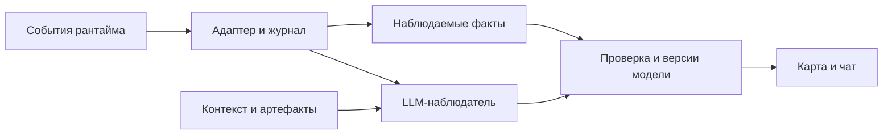

# RFC: aang — наблюдаемость агентной задачи для человека

## 1. Предложение

aang — демон с веб-интерфейсом рядом с агентным рантаймом. Он преобразует события длинного прогона в обновляемый семантический граф: карту смысловых этапов задачи и их связей. Она показывает, что выполняется, кем, что получилось, на каком основании и что требует внимания человека. MVP поддерживает Claude Code и Codex; затем планируется OpenCode.

Длинные сценарии включают исследование, код, тестирование, несколько окружений, ревью и повторные попытки. Поведение задают иерархические CLAUDE.md/AGENTS.md, скиллы, hooks, субагенты и MCP. В собственных облачных харнессах те же инструменты становятся средой выполнения автономных задач. Пользователь видит сообщения об отдельных действиях, но теряет связь между ними и своей целью.

Проблема возникает дважды. Во время работы непонятно, какой этап идёт, кто его выполняет и требуется ли вмешательство. После длинной итерации приходится заново собирать контекст из отчёта, результатов и открытых вопросов. Граф всех вызовов сохраняет эту нагрузку. Человек тратит внимание на реконструкцию процесса, прежде чем перейти к решениям.

**Продуктовая гипотеза:** aang может в разы сократить человеческие трудозатраты на понимание и сопровождение длинного прогона и позволить одному инженеру вести больше задач без потери контроля. Механизм — постоянно поддерживать компактную модель задачи, показывать изменения и направлять внимание к вопросам, требующим решения. Вместо повторного чтения истории человек изучает изменившиеся этапы и при необходимости раскрывает основания.

Гипотеза относится прежде всего к времени восстановления контекста, наблюдения и разбора результатов. Общий выигрыш зависит от доли этой работы: экспертиза, решения и ревью не исчезают. Рост числа сопровождаемых задач возможен, если ограничением было внимание человека. Размер эффекта и влияние ошибок наблюдателя необходимо измерить.

## 2. Два сценария и пример

**Во время работы.** Инженер видит активные этапы и агентов, известные ожидания, последние изменения и свежесть данных. Из этапа он открывает краткое объяснение, входы и выходы, время, доступный расход токенов и исходные события.

**После долгой итерации.** Режим «С последнего просмотра» показывает новые результаты, пересмотренные решения, вопросы и запросы ревью. Финальный текст агента разбирается на связанные с этапами карточки; оригинал остаётся доступен. Порядок внимания объясняется зависимостями, а предложенный LLM приоритет помечается как рекомендация.

Например, после часа работы над дата-пайплайном карта показывает: «Источники изучены», «Пайплайн реализован», «Проверки выполняются», «Публикация ожидает решения». Внутри проверки видны два субагента и результат конкретного запуска. Сообщение «всё готово» не скрывает упавший датачек. Запрос «сверни ревьюеров» убирает подробные действия, сохраняя их существенные замечания в зоне внимания. Это иллюстрация интерфейса, а не фиксированный workflow.

## 3. Что уже существует

Граф и чат сами по себе не отличают aang от существующих продуктов. Langfuse строит граф по наблюдениям и умеет объединять повторяющиеся вызовы по имени; LangSmith Chat отвечает на вопросы по трейсам и диалогам. Это кандидаты для сравнения и возможного переиспользования, а не доказательство свободной ниши. [Langfuse Agent Graphs](https://langfuse.com/docs/observability/features/agent-graphs), [LangSmith Chat](https://docs.langchain.com/langsmith/chat).

Graphectory исследует семантические и временные связи, включая построение графа во время работы. Его результаты вмешательства в агента нельзя переносить на наблюдающий aang. TRAIL показывает сложность диагностики длинных траекторий для исследованных моделей; он не доказывает качество нашего анализатора. Практический вывод: отдельно проверять пользу интерфейса и достоверность его выводов. [Graphectory](https://arxiv.org/abs/2512.02393), [TRAIL](https://arxiv.org/abs/2505.08638).

Предлагаемое отличие aang — устойчивая модель пользовательской задачи поверх разных рантаймов: этапы, результаты, основания и внимание человека. Проверяем, даёт ли она преимущество перед обычной краткой LLM-сводкой по тем же данным. До этого собственный продукт остаётся гипотезой.

## 4. Границы MVP

| Область | Граница MVP |
| --- | --- |
| Сценарии | Оба: наблюдение и возвращение к результатам |
| Рантаймы | Claude Code и Codex; OpenCode после MVP |
| Поверхности | Desktop, CLI и агентные SDK обоих рантаймов: Claude Agent SDK и Codex SDK |
| Среда | Локально и на своих VM/Docker, включая соответствующие режимы Desktop; вендорские облака исключены |
| Подключение | Предварительная настройка hooks, плагинов и сбора событий допустима |
| Интерфейс | Карта этапов, зона внимания, инспектор, чат и режим изменений |
| Чат | Объяснения со ссылками; скрытие, сворачивание, группировка и изменение детализации |
| Полномочия | Только наблюдение и чат с aang; ответы и команды решателю остаются в исходной сессии |
| Наблюдатель | Основной путь — уже авторизованный Claude Code или Codex CLI |

Управление решателем и произвольная смена модели графа не входят в согласованный MVP. Запуск workflow, уведомления, центральный обзор организации и совместная работа — возможные расширения, которые этот RFC не предлагает включать. Предметная логика приходит из окружения задачи; aang не привязан к фреймворку дата-пайплайнов.

Desktop — обязательство MVP. Если для выбранного режима данных недостаточно, это ограничение требуется вынести на решение, а не молча исключить поверхность. Поддержка SDK не означает поддержку произвольного приложения на низкоуровневом API модели.

## 5. Карта и чат

Основное представление — компактная интерактивная карта этапов с раскрытием подзадач и зависимостей. Конкретная раскладка проверяется на прототипе. Одновременная поставка отдельного таймлайна и нескольких видов графа не требуется для проверки основной гипотезы.

У этапа есть название, ожидаемый результат, краткая сводка, состояние, участники и основания. Выбор открывает инспектор с деталями и локальным чатом. Цвет дополняется подписью или значком. Обновления сохраняют выбранный этап и положение чтения; история объясняет объединение, разделение и пересмотр этапов.

Отметка последнего просмотра сохраняется явно: поступление новых событий не означает, что пользователь их прочитал. В зоне внимания находятся явные вопросы, запросы ревью и существенные препятствия. Отсутствие проверки само по себе не создаёт поручение человеку.

Чат отвечает по всему прогону; выбор этапа уточняет контекст. Например: «Почему публикация ожидает решения?» Ответ относится к определённой версии карты, содержит ссылки на основания или сообщает о нехватке данных. Изменение вида сохраняется как отменяемое правило, действует на новые события и не переписывает историю. Скрытые агенты сохраняют вклад в результаты и расход; важные вопросы остаются видимыми. «Просмотрено» не означает «одобрено» и ничего не отправляет решателю.

## 6. Модель и достоверность

Единица наблюдения — **прогон**, работа над одной пользовательской целью. Он может включать продолжения сессии и субагентов. Связи устанавливаются по идентификаторам рантайма либо явной привязке; совпадение каталога проекта недостаточно.

Модель связывает этапы, агентов, действия, версии артефактов и вопросы с исходными событиями. Несколько агентов могут участвовать в одном этапе; один агент — в нескольких. Вложенность, зависимость результата и временная последовательность различаются. Порядок по времени не доказывает причинную связь.

Три вещи показываются независимо:

- **Выполнение:** запланировано, выполняется, ожидает, завершено, ошибка, отменено или неизвестно.
- **Основание вывода:** наблюдаемое событие, заявление решателя или интерпретация aang.
- **Решение человека:** запрошено, принято или отклонено, если это видно в исходной сессии.

«Прошли 14 тестов» подтверждает конкретную проверку, а не всю цель. Для отметки «критерий подтверждён» нужны сам критерий, подходящее наблюдаемое свидетельство и версия результата. Критерий берётся из задания, явного плана или настроенного контракта проверки. Автоматическое подтверждение возможно по такому контракту; если достаточность свидетельства оценила только LLM, это остаётся её интерпретацией. Частичное подтверждение показывается частично. При отсутствии оснований сохраняется «агент сообщил о завершении».

Тест на старом коде не подтверждает текущие изменения автоматически. Если известен только изменяемый путь или URL, это обозначается; ссылка не подменяет сохранённую версию. Аналогично успешный SQL-запрос не доказывает корректность бизнес-вывода.

Молчание не означает зависание. Интерфейс различает известное ожидание, отсутствие новых событий и потерю источника. План может отсутствовать или меняться; восстановленные LLM этапы помечаются. Процент готовности и прогноз окончания не предлагаются для MVP. Скрытый ход рассуждений не восстанавливается: используются доступные сообщения, события и собственная сводка наблюдателя.

## 7. Архитектура и интеграции

Программный демон собирает и нормализует события, хранит курсоры и модель, обслуживает веб-интерфейс. LLM-наблюдатель получает новые события, релевантный контекст и текущие этапы, затем предлагает структурированные изменения со ссылками на источники. Демон проверяет схему, идентификаторы и версию модели, применяет изменения и сохраняет историю. Такая проверка ограничивает ошибки структуры, но не доказывает правильность смысла.

Для анализа используются небольшие порции событий с таймером, чтобы редкие события не ждали заполнения окна. Наблюдатель может обратиться к исходным записям и версиям артефактов; цепочка предыдущих сводок не становится единственным источником. При перепланировании старый подход сохраняется как заменённый. Восстановление повторяет сохранённые изменения модели, а не требует одинаковых ответов LLM при повторном запуске.

Контекст включает разрешённые инструкции проекта, скиллы, определения субагентов, настройки hooks/MCP, Git и отчёты. Структурированные записи прогресса и Git используются и в описанном Anthropic подходе к длинным задачам. Для aang это основание рассматривать несколько источников. Наличие скилла в каталоге при этом не доказывает его чтение или выполнение. [Anthropic: long-running harnesses](https://www.anthropic.com/engineering/effective-harnesses-for-long-running-agents).

| Рантайм | Документированный путь; что ещё проверить |
| --- | --- |
| Claude Code | Hooks и транскрипты, включая события субагентов; проверить выбранные режимы и полноту данных. [Hooks](https://code.claude.com/docs/en/hooks), [сессии](https://code.claude.com/docs/en/sessions) |
| Codex | События управляемого App Server и JSONL-поток headless-запуска; файловый сбор — кандидат для существующих сессий. Проверить подключение без изменения их работы. [App Server](https://learn.chatgpt.com/docs/app-server), [non-interactive mode](https://learn.chatgpt.com/docs/non-interactive-mode) |
| Desktop и SDK обоих рантаймов | Отдельная проверка событий и дочерних сессий. Claude документирует общие hooks для Desktop и CLI, но это не заменяет проверку адаптера. [Claude Desktop](https://code.claude.com/docs/en/desktop#shared-configuration) |

Документация подтверждает наличие интерфейсов, но не готовность адаптеров aang. Поддержка объявляется для конкретной версии и способа запуска после проверки: события инструментов, дочерние агенты, usage, продолжение, сжатие контекста и переподключение. Каждая обязательная поверхность должна проходить оба пользовательских сценария, включая работу с субагентами и результатами. Недоступность отдельных метрик допустима с явной отметкой; невозможность выполнить основной сценарий блокирует заявление о поддержке. Неизвестные записи сохраняются, пробелы видны в UI.

Локальное хранилище, например SQLite, и поток обновлений, например SSE, — обратимые технические кандидаты. Основной backend наблюдателя запускает уже авторизованный Claude Code или Codex CLI в изолированном контексте со структурированным выходом. Проверка интеграций должна подтвердить изоляцию, авторизацию, задержку и расход именно этого пути. Если требования не выполняются, альтернативный backend выносится на согласование.

## 8. Свежесть, доступ и расходы

Предлагаемый ориентир — смысловое обновление в пределах 30 секунд для 95% размеченных контрольных событий, которые должны менять карту, на выбранном профиле нагрузки. Пропущенное обновление считается нарушением. Начало измерения — доступность события для сборщика. При известном времени самого события отдельно измеряется полная задержка. Явный запрос ввода отображается без ожидания LLM. Это кандидат на критерий приёмки, а не подтверждённая характеристика.

При отказе LLM демон продолжает сбор, показывает наблюдаемые факты и возраст семантической модели. После перезапуска восстанавливает курсоры, этапы и состояние просмотра. Повторная доставка не создаёт дублей; невосстановимые пропуски не заполняются догадками. Очереди и повторы ограничены. Сборщик событий не должен блокировать работу решателя при сбое aang.

Наблюдатель читает только выбранные источники; инструкции внутри транскрипта обрабатываются как данные. Он изолирован от полномочий решателя и исключает собственные сессии из наблюдения. Запись разрешена в собственное хранилище. Для удалённого UI нужен защищённый доступ. Разрешённые модели, передаваемые данные, маскирование и срок хранения согласуются до подключения рабочих сессий.

Расход решателя, наблюдателя и чата учитывается раздельно. При отсутствии точной привязки токенов к этапу показывается расход сессии или обозначенная оценка. Одно действие не суммируется повторно; длительность прогона отличается от суммы времени параллельных агентов. Денежная стоимость при подписке может быть неизвестна. Экономика оценивается по замерам на активный час, без заранее обещанной дешевизны.

## 9. Как проверить гипотезу

Нужны две независимые проверки. **Техническая:** каждый обязательный режим поставляет достаточные события; карта и чат работают при параллельности, перепланировании, сжатии контекста, разрывах и перезапуске. **Продуктовая:** авторы длинных прогонов быстрее и правильнее понимают работу и могут сопровождать больше задач с тем же бюджетом внимания.

Для продуктовой проверки сравниваются исходный интерфейс, краткая LLM-сводка и aang на одинаковых данных. На выбранных моментах записей, без будущих событий, человек определяет текущую работу, результат и его основание, нерешённый вопрос и необходимость вмешательства. Ответ «сейчас вмешательство не требуется» тоже допустим. Порядок интерфейсов меняется, чтобы снизить эффект запоминания. Спорные случаи разбирают люди, знакомые с задачей.

| Гипотеза | Что измерять |
| --- | --- |
| Контекст восстанавливается в разы быстрее | Время до правильных ответов и суммарное время сопровождения прогона; отношение к исходному интерфейсу и простой сводке |
| Можно вести больше задач | Число сопоставимых задач при одинаковом времени внимания, с учётом пропущенных вопросов, задержек реакции и ошибок решений |
| Наблюдение остаётся достоверным | Ложные подтверждения, потерянные вопросы, лишний шум и ошибки ответов чата |
| Состояние видно во время работы | Задержка обновлений, доля времени с отставанием и полнота событий в живых запусках |

Ускорение отдельных ответов ещё не доказывает рост производительности: последнее проверяется на живой работе с несколькими задачами. В трудозатраты включаются настройка подключения и представлений, проверка сомнительных выводов и исправление ошибок aang; разовые и регулярные затраты считаются отдельно. Синтетические записи проверяют инварианты, но не подтверждают продуктовый эффект. На контрольных сценариях недопустимы ложный подтверждённый успех и потеря явного блокирующего вопроса.

Конкретные данные, участники и пороги ещё не выбраны; их фиксируют до оценки. Продолжение оправданно, если понимание ускоряется без потери правильности. Если выигрыш есть только в части сценариев, концепт можно сузить. Если простая сводка даёт сопоставимый результат, необходимость отдельного интерактивного продукта следует пересмотреть.

## 10. Что остаётся проверить

Основные риски: правдоподобная, но неверная карта; повторная перегрузка пользователя; неполные события; отставание и расход наблюдателя. Им соответствуют проверяемые основания, постепенное раскрытие деталей, испытания каждого адаптера и отдельные замеры свежести и затрат. Наличие нового интерфейса само по себе не уменьшает человеческую работу.

До рабочих запусков нужно определить разрешённые данные, правила передачи и хранения, условия авторизации CLI и допустимый расход. Эти условия в исходных материалах расходятся и пока не согласованы; RFC не утверждает ни отсутствие ограничений, ни готовность корпоративного развёртывания.

На ревью выносится концепт: поддерживать живую семантическую модель задачи и использовать её как интерфейс понимания, проверки и распределения внимания. Скоуп MVP зафиксирован в разделе 4. Реализуемость каждой интеграции и гипотеза кратного выигрыша проверяются отдельно; изменение согласованного охвата требует отдельного решения.
